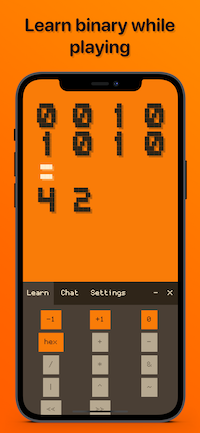

# I AM 414C

_"With an affecting story and a genuinely unexpected resolution, I AM 414C effortlessly blends mathematical and linguistic challenges."_ - metro.co.uk

_"I AM 414C is more than just a fun text adventure. It's a step back in time for some unique fun."_ - appadvice.com

I AM 414C is an educational text adventure game based on communication with a robot named 414C. The robot is damaged and has forgotten all the letters. Help 414C recover its memory by solving binary operations, uncovering ASCII letters, and chatting with it to reveal its past and purpose.

## Features

- Procedurally generated binary puzzles, offering a unique experience each playthrough.
- Customizable font size, theme, and difficulty levels.
- Engaging story with multiple endings.
- Educational screen for learning binary and hexadecimal operations.
- No in-app purchases, no ads, and no tracking.

## Preview

  
  
  
  
  
  
  

## About This Repository

The game is no longer available on the iOS App Store due to maintenance constraints. By publishing this repository, I aim to assist others with their SwiftUI projects and provide insights into the development of "I AM 414C."

## License 

This project is licensed under the MIT License.
